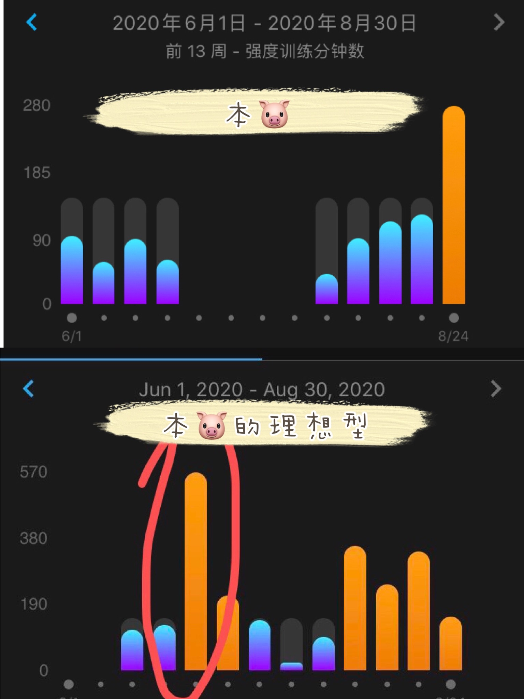
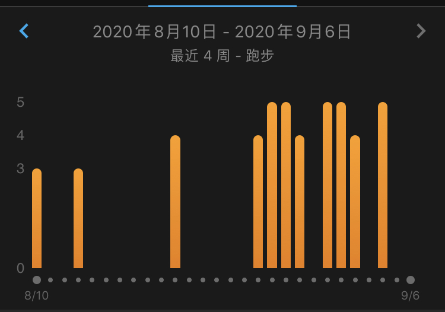
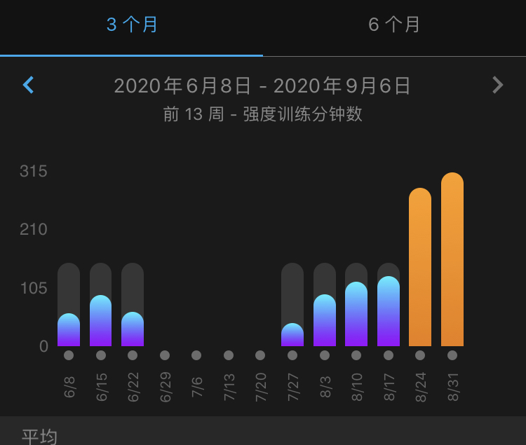
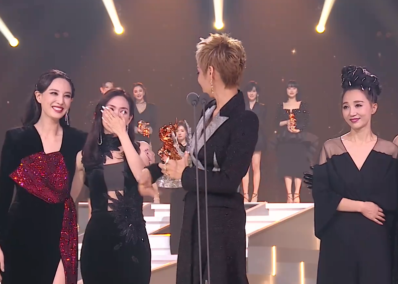
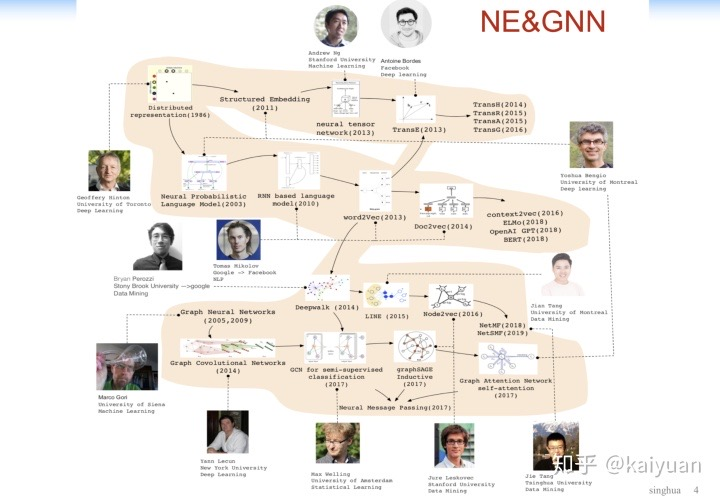

这两周咱俩一起跨大洋跨大洲干了啥呢？

被理想型的运动记录激励以及被单调增的体重震慑了之后，本肥宅重出江湖开始运动。

(第一周是这样的)

经过了两周的不懈努力，每天早上去公司跑步，第一次感受到跑步跑到肌肉酸，（体重居然没怎么降，为什么为什么为什么啊），达成了图示成就。

终于把多周不及格的每周高强度活动时间重新刷了回来，变成了这样：

上周末好好虐了一把头发，又烫又染，改走轻熟风。建议几乎全部来自Tony，表示对深圳一家小理发店的Tony非常满意。

最重要的是，此发型得到了老公的好评:heart::heart::heart:

上周周末，为帮老公配置博客的开发环境，咱俩一起尝试使用钉钉，并对钉钉screenshare+视频聊天的功能非常满意。于是我俩进一步发挥，就有了这周同步看浪姐成团夜的场景。。。

被静姐整得一愣一愣的。无奈wuli韵韵子没能走花路💔

本周五晚上，咱俩启动了PhD预备状态，开始选导师选学校。刚开始有些分歧呢，在双方是去美国还是去欧洲的观点上，还一度争执得很激烈。但咱俩原则是一致的，“两个人一定要结束异地”状态。既然都认可的大方向这么有爱，我们果断放弃了那些分歧，为了光明的未来共同努力呀。

周六晚上，钉钉再次派上用场，一起看老师，准备各种备选。在挑选老师的过程中，我一遍遍接受大神光芒的照耀，被打足了鸡血。

膜诸神，我们会努力的！

（在诸神的感召下，我今天宅在家里把William L. Hamilton的新书看了一半，并收到了如下警告）

一起努力的感觉真好！